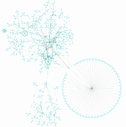

# Extended Python Support for yEd 

This Python library extends [yEd](http://www.yworks.com/en/products_yed_about.html) functionality through programmatic interface to graphs (of the [GraphML](http://graphml.graphdrawingraph1.org/) file format), including the following:
- [x] creating graphs
- [x] formatting graphs
- [x] reading graphs  - **Initial Draft Implementation**
- [x] bulk data management methods  - **Initial Draft Implementation**
- [x] management of the yEd application - **Initial Draft Implementation**
- [ ] enforcing rules on graphs
- [ ] addition of standard sorting methods




## Usage
The basic interface is similar to that of NetworkX, but modified to match yEd usages:

```python
import yedextended as yed

#Instantiate graph instance
graph1 = yed.Graph()

# Add several nodes and edges with mostly default properties
graph1.add_node('foo', font_family="Zapfino")
graph1.add_node('foo2', shape="roundrectangle", font_style="bolditalic", underlined_text="true")

graph1.add_edge('foo1', 'foo2')
graph1.add_node('abc', font_size="72", height="100", shape_fill="#FFFFFF")

graph1.add_node('bar', label="Multi\nline\ntext")
graph1.add_node('foobar', label="""Multi
    Line
    Text!""")

graph1.add_edge('foo', 'foo1', label="EDGE!", width="3.0", color="#0000FF", 
               arrowhead="white_diamond", arrowfoot="standard", line_type="dotted")

# Demonstrate stringified graphml version of structure
print(graph1.stringify_graph())

# Several methods of writing to file:
with open('test_graph.graphml', 'w') as fp:
    fp.write(graph1.stringify_graph())  

graph1.persist_graph('example.graphml')

# (including pretty print with whitespace)
graph1.persist_graph('pretty_example.graphml', pretty_print=True)

```

Saving this to a file with a ``.graphml`` extension, opening in yEd, applying  ``Tools -> Fit Node to Label``(_Win: Alt + T + N_) and ``Layout -> Hierarchical``(_Win: Alt + Shift + H_) produces something like the following:


### UML
The file [``examples/demo-uml.py``](./examples/demo-uml.py), includes an example UML diagram:


## Options

Provides comprehensive support for ``node_shapes``, ``line_types``, ``font_styles``, ``arrow_types``, custom parameters and more.

## Development

Interested in contributing or co-managing further development?  Just reach out!

Requirements:

    $ pip install pytest

Run the tests:

    $ PYTHONPATH=. pytest tests

References: 

+ [GraphML Primer](http://graphml.graphdrawingraph1.org/primer/graphml-primer.html)
